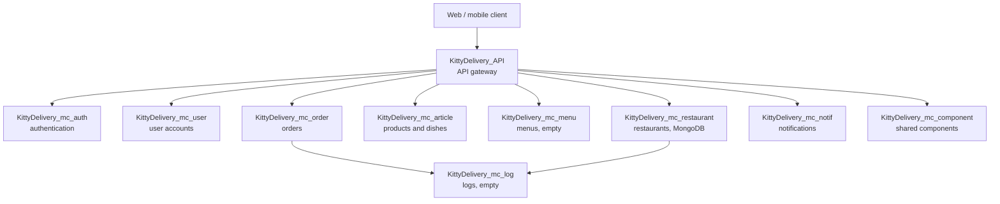

<div align="center">
  

  <h1>KittyDelivery, Microservices Architecture</h1>

  <p>
    Hub repository for the KittyDelivery project, a food delivery application built as a student exercise, split into several independent Node.js / Express microservices.
  </p>

  <p>
    
    
    
    
    
  </p>
</div>

<br />

## :notebook_with_decorative_cover: Table of Contents

- [About the Project](#star2-about-the-project)
- [Architecture](#building_construction-architecture)
- [Related Repositories](#link-related-repositories)
- [Getting Started](#toolbox-getting-started)
  * [Prerequisites](#bangbang-prerequisites)
  * [Clone with submodules](#gear-clone-with-submodules)
  * [Run with Docker Compose](#running-run-with-docker-compose)
- [Contact](#handshake-contact)

## :star2: About the Project

KittyDelivery is a food delivery application (similar to Uber Eats) designed as a microservices architecture exercise: each business unit (users, restaurants, authentication, notifications, articles, orders, menus, logs) lives in its own GitHub repository, with its own `package.json` and, for some, its own Dockerfile.

This repository does not contain business logic: it is the single entry point to navigate between services, understand the overall architecture, and run everything locally through Docker Compose.

At this stage, most microservices are skeletons generated with `express-generator` (a home route and a sample `/users` route, without added business logic). `KittyDelivery_mc_restaurant` declares Express and Mongoose as dependencies and has a Dockerfile, but its entry point (`index.js`, declared as `main` in its `package.json`) is missing from the repository and no `start` script is defined: the container builds but does not start as is. `KittyDelivery_mc_log` and `KittyDelivery_mc_menu` are empty repositories, reserved for future implementation.

## :building_construction: Architecture



This diagram represents the likely interactions between services based on their declared role. At this stage of the project, the API gateway does not yet contain effective routing logic to the other services: it only exposes the default routes of the Express skeleton.

## :link: Related Repositories

| Repository | Role | Status |
| --- | --- | --- |
| [KittyDelivery](https://github.com/kitty-delivery/KittyDelivery) | Main repository, project entry point | Documentation only |
| [KittyDelivery_API](https://github.com/kitty-delivery/KittyDelivery_API) | API gateway, meant to route to the other services | Express skeleton |
| [KittyDelivery_mc_user](https://github.com/kitty-delivery/KittyDelivery_mc_user) | User account management (internally named "Delivery") | Express skeleton |
| [KittyDelivery_mc_restaurant](https://github.com/kitty-delivery/KittyDelivery_mc_restaurant) | Restaurant management (Express, MongoDB planned) | Dockerfile present, entry point missing |
| [KittyDelivery_mc_auth](https://github.com/kitty-delivery/KittyDelivery_mc_auth) | Authentication (internally named "General") | Express skeleton |
| [KittyDelivery_mc_component](https://github.com/kitty-delivery/KittyDelivery_mc_component) | Shared components (internally named "Developer") | Express skeleton |
| [KittyDelivery_mc_notif](https://github.com/kitty-delivery/KittyDelivery_mc_notif) | Notifications (internally named "Client") | Express skeleton |
| [KittyDelivery_mc_article](https://github.com/kitty-delivery/KittyDelivery_mc_article) | Products and dishes (internally named "Restaurant") | Express skeleton |
| [KittyDelivery_mc_log](https://github.com/kitty-delivery/KittyDelivery_mc_log) | Log centralization | Empty repository |
| [KittyDelivery_mc_menu](https://github.com/kitty-delivery/KittyDelivery_mc_menu) | Menu management | Empty repository |
| [KittyDelivery_mc_order](https://github.com/kitty-delivery/KittyDelivery_mc_order) | Orders (internally named "Commercial") | Express skeleton |

## :toolbox: Getting Started

### :bangbang: Prerequisites

- Git
- Docker and Docker Compose
- Node.js (to run services without Docker)

### :gear: Clone with submodules

```bash
git clone --recurse-submodules https://github.com/kitty-delivery/KittyDelivery_core.git
cd KittyDelivery_core
```

If the repository was already cloned without the `--recurse-submodules` option:

```bash
git submodule update --init --recursive
```

### :running: Run with Docker Compose

```bash
docker compose up --build
```

Each Express skeleton listens on port 3000 by default inside its container; they are exposed on distinct host ports (see `docker-compose.yml`) so they can run simultaneously, through a shared generic Dockerfile (`docker/node-express.Dockerfile`) since none of them has its own. Since `KittyDelivery_mc_log` and `KittyDelivery_mc_menu` are empty repositories, and `KittyDelivery_mc_restaurant` has no working entry point, these three services are left commented out in `docker-compose.yml` until application code is added.

## :handshake: Contact

Brieuc Dumortier, [LinkedIn](https://www.linkedin.com/in/dumortier-brieuc/), [GitHub](https://github.com/BaditSad), dumortier.contact@gmail.com
